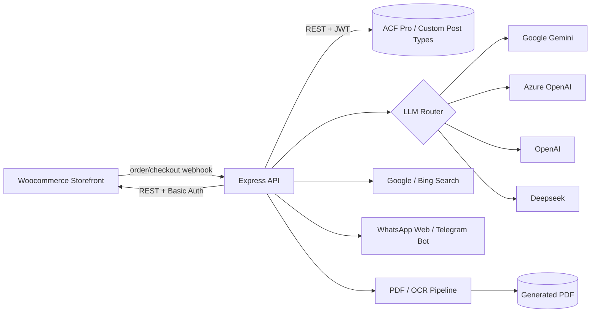

  

# Welcome to BIGRIT — Agentic AI Backend

> **Note on visibility:** This repository is private and will remain private. It powers live products with real customer data, credentials, and business logic.

BIGRIT is a Node.js/Express backend that powers a family of AI products served through a WooCommerce storefront, with WordPress (ACF Pro + custom post types) as the data layer between the store and the AI pipelines. It orchestrates multiple LLM providers, messaging platforms, document processing, and web search into production agentic workflows.

---

## Architecture at a glance

Every customer-facing product follows the same webhook-decoupled shape: WooCommerce fires an order event, the API authenticates it, creates/updates a record, returns immediately, and continues the AI generation work asynchronously, so slow LLM/PDF/search calls never block the storefront.

---

## Idris AI

A credit-based conversational AI assistant delivered over **WhatsApp** and **Telegram**, with OTP-verified onboarding and persistent per-user chat history.

### End-to-end flow

1. Customer buys credit on WooCommerce → webhook hits `POST`, authenticated with a constant-time header check (`timingSafeEqualString`, `crypto.timingSafeEqual`).
2. Order/phone data is de-duplicated against existing `idris_ai` records, then a new record is created via the WP REST API (JWT auth).
3. A 6-digit OTP is generated and sent over WhatsApp; the user verifies by replying, flipping `otp_verified` in the record.
4. Once verified, inbound messages are picked up by a persistent WhatsApp/Telegram listener, buffered per user, and debounced (0–4000ms depending on message burst) so a user typing multiple lines is treated as one turn.
5. The message is routed through a multi-provider LLM fallback chain (Gemini → Azure OpenAI → OpenAI), with credit balance deducted per response and milestone notifications at 50/80/100% quota usage.
6. Responses are streamed back in natural, chunked paragraphs, and are **interruptible**. If the user sends a new message mid-response, the in-flight send is aborted cleanly.
7. Full chat history is persisted to database, per user identifier, for continuity across sessions.

### Notable engineering

- **Distributed user locking**: a lightweight in-process lock/queue keyed by user ID, held for up to 30 minutes, preventing concurrent requests for the same user from corrupting ACF read-modify-write cycles.
- **Interruptible streaming**: message delivery is chunked and can be aborted mid-send when the user starts a new turn, avoiding the classic "bot keeps talking after I already replied" UX problem.
- **Dual-channel parity**: WhatsApp and Telegram implementations share the same debounce/buffer/fallback logic so behavior is consistent across channels.
- **Security**: all webhook endpoints validate a shared-secret header, plus strict numeric ID validation on all identifiers.

---

## Artikel AI

An autonomous long-form article generation pipeline: a customer fills out a form (topic, style, language, target word count, structure, reference documents), and the system researches, writes, illustrates, and delivers a cited article.

### End-to-end flow

1. WooCommerce order + Gravity Forms field data → webhook `POST`, same auth/dedup/WordPress-post-creation pattern as Idris.
2. **Reference ingestion**: any user-supplied reference files/URLs are downloaded and parsed for text in a sandboxed child process (60s timeout). An LLM call validates whether the extracted text is actually usable; if not, the PDF is rasterized page-by-page and run through Tesseract OCR as a fallback.
3. **Outline generation**: an LLM produces a structured breakdown of sections, an image prompt, and bilingual (EN/ID) search queries — using **JSON-schema-constrained output** so downstream code can parse it deterministically instead of scraping free text.
4. **Research**: each search query is run against Google Custom Search and Bing Search, results are filtered (drop forums/social/duplicate domains), and an LLM selects the single best source per section.
5. **Section-by-section drafting**: for each outline section, a prompt is built from topic/style/language/word budget/selected references, and content is generated through the same multi-provider fallback chain used by Idris.
6. **Illustration**: a hero image is generated, retries on failure.
7. **Assembly & delivery**: sections + image are composed and converted to PDF, compressed, and the customer is notified with a download link. A companion endpoint supports post-delivery revision requests that re-run research/generation against updated references.

### Notable engineering

- **Multi-model orchestration with cost accounting**: a `buatPilihanModel()` factory builds a uniform interface (`apiCall`, `cekRespon`, `ambilKonten`, token counters, `hitungBiaya`) over four LLM backends, so any generation step can fall back across providers without duplicating call logic. Every call's token usage and USD cost (per published per-token pricing for each provider) is tallied and persisted for billing/analytics.
- **Resilient retries**: `apiCallWithRetry` retries transient failures (429/5xx) with exponential backoff (3s → 6s → 12s).
- **Quality-gated OCR fallback**: rather than always OCR'ing or always trusting raw PDF text extraction, an LLM is used as a judge to decide *which* extraction path produced usable text, improving both cost and article quality.
- **Structured output everywhere**: both the outline and section-drafting steps use JSON-schema/response-format constraints on the LLM calls (Gemini `responseSchema`, OpenAI `json_schema` strict mode) instead of prompt-engineered free text, making the pipeline robust to model drift.
- **Production/staging parity**: a full staging variant mirrors production logic so pipeline changes can be validated against real search/LLM providers before going live.

---

## Cross-cutting platform patterns

| Concern | Approach |
|---|---|
| **Webhook decoupling** | Storefront webhooks return immediately after auth + record creation; all AI work happens asynchronously so slow generation never blocks WooCommerce. |
| **Auth** | Shared-secret header; JWT bearer tokens; WooCommerce Basic Auth (consumer key/secret). |
| **Input validation** | All externally supplied IDs are validated as bounded numeric strings before use in any query. |
| **Concurrency safety** | Per-user distributed lock/queue around WordPress ACF read-modify-write cycles. |
| **LLM resilience** | Every generation step is backed by a provider fallback chain (Gemini → Azure OpenAI → OpenAI → Deepseek) with retry + backoff, so a single provider outage doesn't take down the product. |
| **Cost observability** | Token counts and USD cost are computed per API call (per-provider, per-model pricing) and rolled up per order for billing and margin analysis. |
| **Structured LLM output** | JSON-schema-constrained responses are used wherever downstream code needs to parse the model's output, instead of regex/string scraping. |
| **Logging** | Every log line is prefixed with a request/context identifier for easy filtering in production. |

## Current Tech stack

- **Runtime**: Node.js, Express
- **LLMs / AI**: Google Gemini (Vertex AI), Azure OpenAI, OpenAI, Deepseek, DALL·E 3; `@langchain/core`, `@langchain/langgraph`, `@google/genai`
- **Messaging**: `whatsapp`, `telegram`
- **Document processing**: `pdf-parse`, `pdf2json`, `pdf-to-img`, `tesseract.js` (OCR), `sharp`, `libreoffice-convert`, `compress-pdf`
- **Search**: Google Custom Search API, Bing Search API
- **Data layer**: WP REST API + ACF Pro, WooCommerce REST API, SQLite (chat history), Gravity Forms
- **Infra**: `axios` + `axios-retry` with global retry/backoff policy, `dotenv` for config
